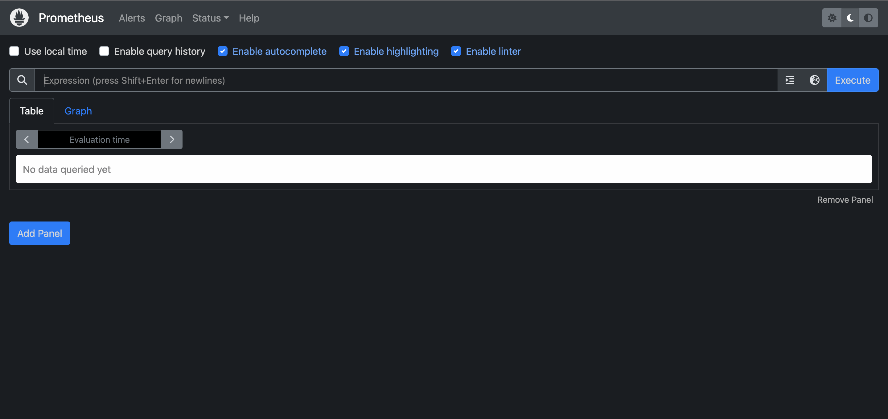

# 4-golden-signals-demo

Окружение для вебинара [Prometheus + Grafana настраиваем 4 golden signals](https://slurm.io/webinars/grafana)

## Requirements

- Visual Studio Code
- Docker + docker-compose

## Структура репозитория

```
├── .devcontainer - описание dev контейнера
├── .vscode - конфигурация Visual Studio Code
├── configs - конфигурация Prometheus
├── demoapp - демо-приложение, отдающее метрики
│   ├── cmd
│   │   ├── app - демо-приложение, отдающее метрики
│   │   └── load - скрипт для генерации нагрузки на демо-приложение
│   └── internal - внутренние библиотеки
│       ├── helpers - вспомогательные методы (e.g. генерация случайных http кодов)
│       ├── metrics - описание метрик
│       └── middleware - middleware для сбора метрик
└── docs - документация
```

## Как работать с репозиторием

1. Клонируем репозиторий и открываем его в Visual Studio Code
2. Visual Studio Code предложит открыть репозиторий внутри docker контейнера, соглашаемся и ждем 
3. После того как открылось новое окно Visual Studio Code, убеждаемся в доступности локального окружения
   1. Убеждаемся что Prometheus доступен по адресу `localhost:9090` 
   2. Убеждаемся что Grafana доступна по адресу `localhost:3000` 
   3. Убеждаемся что в Grafana можно войти с логином и паролем по умолчанию - `admin:admin`
   4. Запускаем демо-приложение, которое должно отдавать метрики - `F5`
   5. Убеждаемся что демо-приложение отдает метрики по адресу `localhost:8080/metrics` 


### Домашнее задание

## Links

https://prometheus.io/docs/guides/go-application/
https://grafana.com/blog/2022/03/01/how-summary-metrics-work-in-prometheus/
https://www.robustperception.io/how-does-a-prometheus-summary-work/